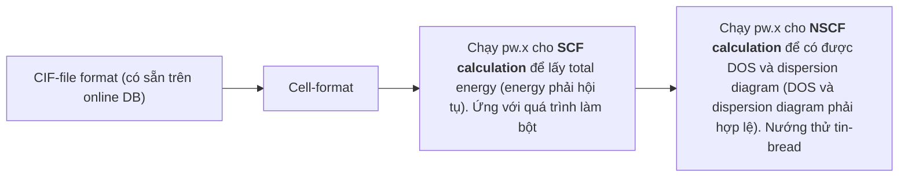

# qe_tutorial

- Tài liệu này dùng để ghi lại quá trình học các tutorial về QE. Tham khảo chính: từ cuốn `QE Tutorials` của Nguyễn Tuấn Hưng và `First principles calculation` của Prof. Maezono

- Một số nội dung cần được cover
    - Tính toán SCF
    - Tính toán NSCF
    - Các tính toán về Bands
    - Quick check kết quả cho các tính toán trên
    - Xác định tính chất vật liệu sau khi đã tính toán

## Basic parameters

- Trước khi khởi chạy QE, cần phải specific các parameters cho input. Tại đây sử dụng `graphene, quartz(cristobalite)-alpha(beta)` làm vật liệu ví dụ.

### Flow làm việc



### Total energy and self-consistent field calculation

- **Mục tiêu**:
    - Total energy được tính bằng phương pháp SCF calculation. Từ năng lượng toàn phần, có thể suy ra các tính chất về trạng thái cơ bản (ground-state properties)
    - Ground-state properties có thể được dùng trong các tính toán liên quan đến phonon

- **Nền tảng**: Total energy và SCF calculation sẽ được trình bày trong chương 4. Cụ thể: 4.5 và 4.12 của cuốn QE Tutorials

- **Lệnh chạy**:

    ```bash
    cd ~/QE-SSP/gr/scf/ # file scf.in được lưu trữ ở đây
    mpirun -np 4 pw.x < scf.in > scf.out &
    ```

    - `mpirun` cho phép chạy song song trên CPU. `-np 4` ám chỉ chạy trên 4 nhân CPU.
    - `pw.x` (pw = plane-wave, x = executable file): lệnh này nhận vào `scf.in` (sử dụng `<` để redirect input vào `pw.x`) và ghi kết quả liên tục vào `scf.out` (sử dụng `>` để redirect output vào `scf.out`). Sau khi chạy xong, file `scf.out` sẽ có các thông tin liên quan đến vòng lặp, năng lượng toàn phần,... và cuối file này sẽ có nội dung:
        ```text
        =------------------------------------------------------------------------------=
        JOB DONE.
        =------------------------------------------------------------------------------=
        ```
    - `&`: Cho phép chạy nền dòng lệnh này.
    - Lưu ý: Cần khoảng 30 phút để chạy xong lệnh này với 25 iterations, 4 cores CPU M1 Chip.

- Nói thêm về file input dạng cell-format:
    - Thẻ `&CONTROL` chứa các thông tin để định nghĩa việc tính toán, cụ thể:
        - Task tính toán: `calculation: 'scf'`
        - `Pseudo_dir`: Đường dẫn đến các file `*.UDF`
        - `outdir` và `prefix`: Không có gì đáng bàn

    - Thẻ `&SYSTEM, &ELECTRONS`: Chưa rõ tính năng
    - Thẻ `ATOMIC_SPECIES`: Bao gồm tên, khối lượng và pseudo potential (sẽ dùng tên ở trong này để search trong `pseudo_dir`) của mỗi nguyên tử trong hệ
    - Thẻ `ATOMIC_POSITIONS`: Specify vị trí của các nguyên tử trong hệ
    - Thẻ `K_POINTS`: Chưa rõ tính năng
    - Trong sách của Prof. Maezono, chúng ta sẽ chuẩn bị file input bằng cách lấy thông tin về cấu trúc hình học của phân tử từ [AMCSD](http://rruff.geo.arizona.edu/AMS/amcsd.php) (1 database về cấu trúc của các phân tử). Sau đó sử dụng [xFroggie](https://xfroggie.com/strconv=convert) để convert thành file input (cell format) cho QE. Download định dạng cell-format về và hiệu chỉnh thêm các thông số liên quan đến tag `&CONTROL, &SYSTEM,...` để thu được file input cuối cùng.

- Một input nữa cũng ảnh hưởng đến quá trình chạy và phải được specify trước là **Pseudo Potential**. Nói chung là cái này mô tả sự tương tác của các electron với nhau và của electron với hạt nhân. Việc tính toán sự tương tác này có thể được thực hiện trong lúc giải phương trình Schrodinger nhưng làm như vậy rất tốn thời gian. Do đó, người ta tạo sẵn ra cái này rồi input vào. Có vẻ thế năng này được gây ra bởi lực Coulomb.

- `outdir`, theo mô tả của Prof. Maezono, được dùng như "bread dough". Dữ liệu trong này sẽ được đem đi phân tích, để đi đến kết luận xem có xài được chưa. Tiếp đến sẽ là làm thử "tin bread", rồi cuối cùng mới là "fancy bread". Thông thường, lượng dữ liệu này rất lớn. Do đó, sau khi phân tích xong, sẽ chỉ giữ lại `scf.in` và `scf.out`.

- Sau khi có được `scf.out`, cần phải quick check để xem cái file input này có xài được không. Quick check bằng cách quan sát năng lượng toàn phần có hội tụ hay không. Để ý rằng sau mỗi vòng lặp, năng lượng toàn phần sẽ được ghi lại bên trong file này. Chỉ cần plot đống năng lượng đó ra là có thể quick check dễ dàng về việc hội tụ
    - Ta sẽ sử dụng lệnh `grep 'total energy' scf.out | sed 's/!//g'| awk '{print $4}' > tmp && sed '$d' tmp > scf.en` để lọc ra các giá trị năng lượng và lưu vào file `scf.en`. Lưu ý rằng việc lọc này có thể làm thủ công hoặc bán tự động, nhưng thực sự không nên vì một vài vật liệu có thể chạy cả trăm iterations.
    - Sau khi lọc xong, ta sẽ thu được 1 file text chứa các giá trị năng lượng trên mỗi dòng. Lúc này chỉ cần sử dụng Python (chưa code) hoặc Gnuplot (`plot 'e.quartz_alpha.txt' pointsize 3 pointtype 4, 'e.quartz_alpha.txt' with line`) để print out cái biểu đồ.


